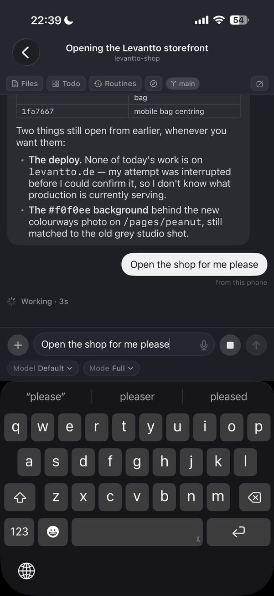
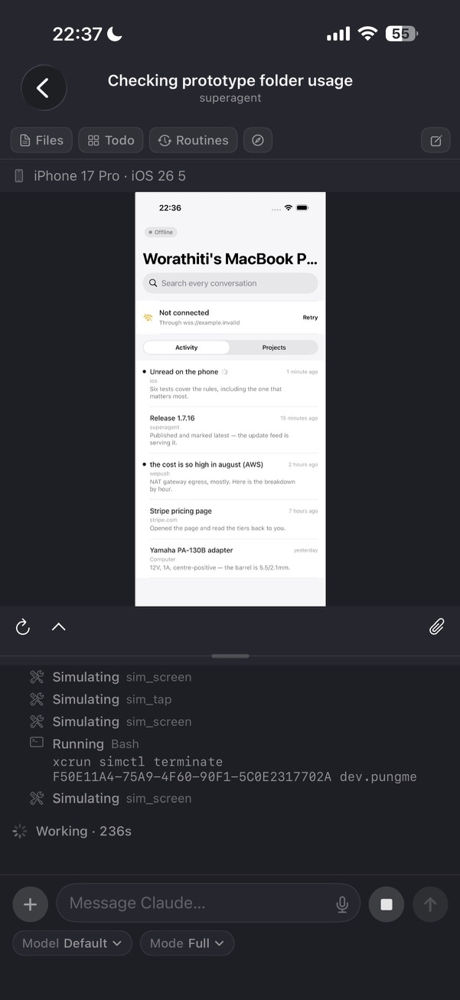
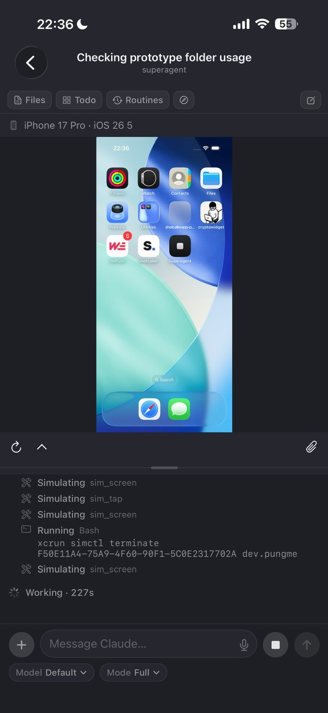
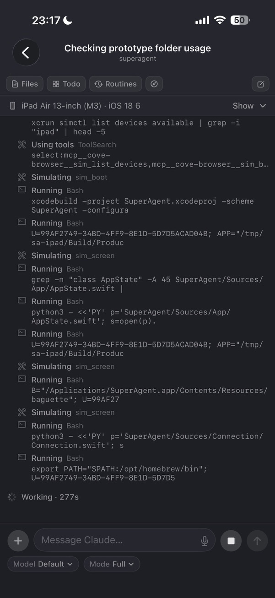

<p align="center">
  
</p>

<h1 align="center">Superagent for iPhone</h1>

<p align="center"><b>Your Mac's agent, in your pocket.</b></p>

<p align="center">The phone half of Superagent: follow the agent running on your Mac, send it work, and answer what it asks — from anywhere. Pair once by scanning a code. No account, no sign-in, end-to-end encrypted.</p>

<p align="center">
  <a href="https://testflight.apple.com/join/hvg9RGMh"></a>
  
  
  
  <a href="LICENSE"></a>
</p>

<p align="center">
  <a href="https://testflight.apple.com/join/hvg9RGMh"><b>⬇ Join the TestFlight</b></a> ·
  <a href="https://superagent.computer/">Website</a> ·
  free &amp; open source
</p>

<p align="center">
  <a href="https://github.com/pungme/superagent-desktop">desktop</a> ·
  <b>iOS</b> (this one) ·
  <a href="https://github.com/pungme/superagent-relay">relay</a>
</p>

The agent is on your Mac. You are not always at it. This app is the other end of
that conversation: the transcript as it streams, the tool steps folded up, the
diffs, the questions it needs answered — and a composer to send it somewhere new
from the sofa or the train.

Nothing runs here. The phone is a window onto the Mac, so it is the Mac's Claude
subscription, the Mac's files, the Mac's browser. Between the two there is only a
blind relay that forwards ciphertext it cannot read.



---

## What it does

<table>
<tr>
<td width="46%" valign="top">

**Two ways to read one Mac.** *Projects* is the desktop's sidebar, where you find
a conversation by knowing where it lives. *Activity* is the one a phone actually
wants: every conversation on the Mac in one flat list, newest first, the way
every messaging app you own is arranged — with a dot on anything you have not
read yet.

</td>
<td valign="top"></td>
</tr>

<tr>
<td width="46%" valign="top">

**Watch what it is building.** When the Mac has a page or an iOS Simulator open,
it is mirrored above the conversation — refreshed as the agent works, resizable,
and collapsible when you just want to read. Send the current frame back into the
chat to ask about what you are looking at.

</td>
<td valign="top"></td>
</tr>

<tr>
<td width="46%" valign="top">

**On iPad, the Mac's shape.** Sidebar on the left, conversation on the right,
the mirrored page beside it — the desktop layout on a screen with room for it,
rather than a stretched phone.

</td>
<td valign="top"></td>
</tr>
</table>

- **The whole conversation, live.** Streaming Markdown, code blocks you can copy,
  tool runs folded into one line you can open, diffs as cards, and the agent's
  questions as buttons you can answer — the same rows the Mac draws, at a size
  your thumb can hit.
- **The sidebar is the Mac's.** Computer at the top with its own conversations,
  plain browser tabs next, then your projects grouped the way you group them —
  nested repos, conversations and routines underneath, a spinner while the agent
  works, the git branch where you expect it.
- **Approve from the lock screen.** When the agent asks permission in Ask mode,
  the notification carries **Approve** and **Deny**. Answer without opening the app.
- **Unread, where you would expect it.** A dot on any conversation that moved
  while you were away — the same dot the Mac draws, in the same place.
- **Readable with the Mac asleep.** The sidebar, your conversations and recent
  transcripts are cached on the phone, so it opens to something even when the
  other end is off.
- **Sending is optimistic.** Your message appears immediately, queues if the Mac
  is unreachable, and delivers when it comes back — with Retry or Discard if it
  is refused.
- **Files, PDFs and pictures.** Browse the project, read source, rendered
  Markdown, images and PDFs; when the agent opens a file for you, it opens here too.
- **Talk instead of typing.** Hold the mic and speak; transcribed on the phone.
- **Scales with your text size.** Every size follows Larger Text, all the way up
  through the accessibility sizes.

Where the phone still differs from the Mac is tracked in [PARITY.md](PARITY.md).

## How it connects

- The Mac keeps one outbound WebSocket to a relay; the phone connects to the same room by the
  Mac's id. The relay ([superagent-relay](https://github.com/pungme/superagent-relay)) only
  forwards opaque frames — it never holds a key that could read one.
- Pairing: the Mac shows a QR (or a link); the phone shows the same 6-digit code; you accept on
  the Mac. That hands the phone a per-device secret; keys are derived from it (HKDF-SHA256),
  frames are AES-256-GCM.
- Push notifications (done / needs you / approvals with Approve & Deny) come through the relay,
  which holds the APNs key for the App Store build. A self-hosted relay works without push.
- With the Mac asleep the app still reads: sidebar, conversations and recent transcripts are
  cached on the phone.

## Build

```sh
brew install xcodegen      # once
make open                  # generates SuperAgent.xcodeproj and opens it
make test                  # Swift Testing, on the first iPhone simulator
```

The `.xcodeproj` is generated from `project.yml` and git-ignored — edit `project.yml`, not the
project. To run on a device, set your own `DEVELOPMENT_TEAM` in `project.yml` (or in Xcode →
Signing & Capabilities) and change the bundle id; the default id belongs to the App Store build.

`make build` compiles without signing, which is fine for a syntax check but produces an app that
cannot read the Keychain — install one over a signed build and it will look unpaired. Build from
Xcode, or with signing on, for anything you intend to actually use.

- iOS 26+, SwiftUI, Swift 6 strict concurrency
- Layout: `App/` (state, theme from the desktop's CSS), `Protocol/` (wire frames, shared with the
  desktop's `companion-protocol.ts`), `Connection/` (crypto, relay transport, connection),
  `Store/` (paired Macs, offline cache), `Pairing/`, `Push/`, `Features/` (sidebar, chat,
  files, board, routines, browser mirror)
- `SuperAgentTests/Fixtures` are copies of the desktop's wire fixtures (`make fixtures` refreshes
  them); both test suites decode the same files.

## Testing against a desktop

Run the desktop from source with a scratch profile and a local relay, then pair the simulator by
pasting the link the Mac's Settings → Phone offers:

```sh
# relay
cd ../relay && PORT=8790 npx tsx src/node.ts
# desktop
cd ../desktop/app && COVE_USER_DATA=/tmp/superagent-dev COVE_RELAY_URL=ws://127.0.0.1:8790 npx electron-vite dev
```

`-scrollHarness` as a launch argument opens a synthetic transcript, so the chat can be exercised
in the simulator without pairing anything.

## License

MIT — see [LICENSE](LICENSE).
